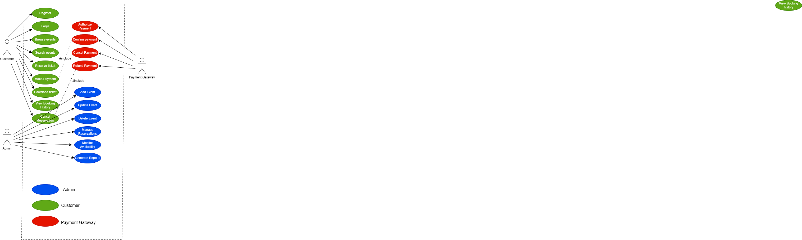
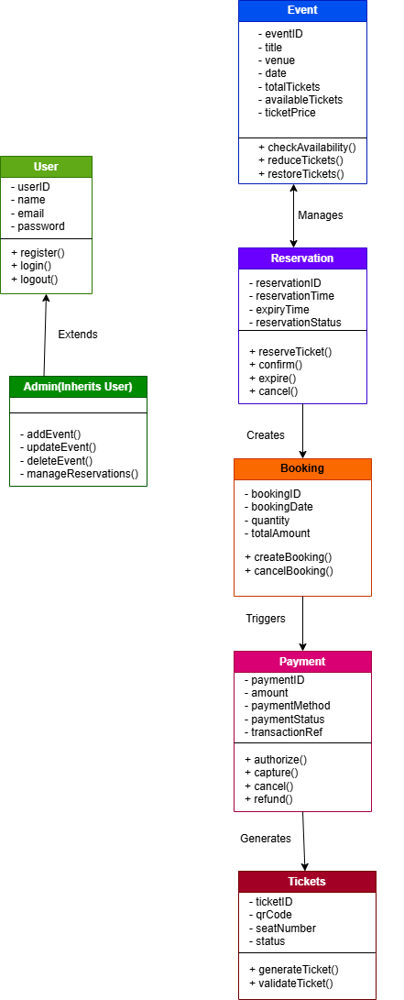
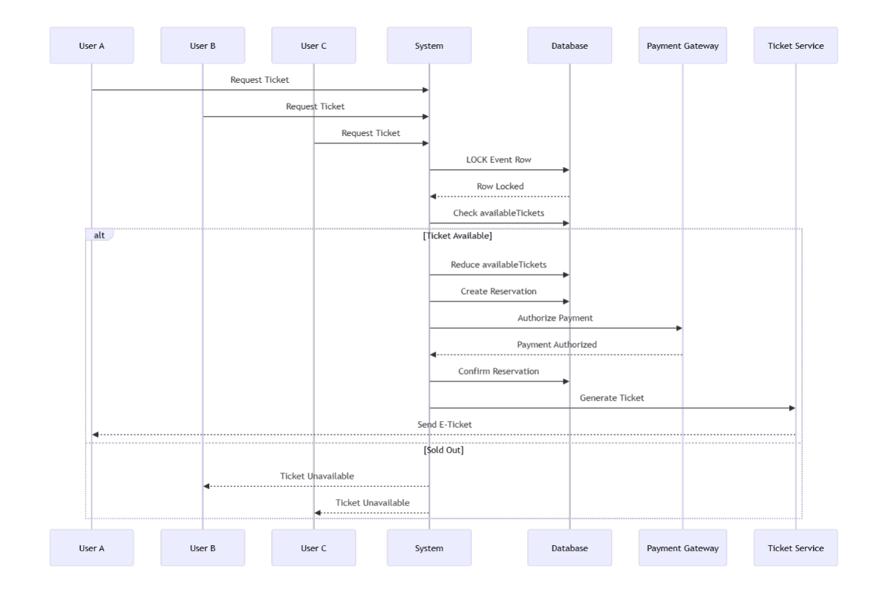
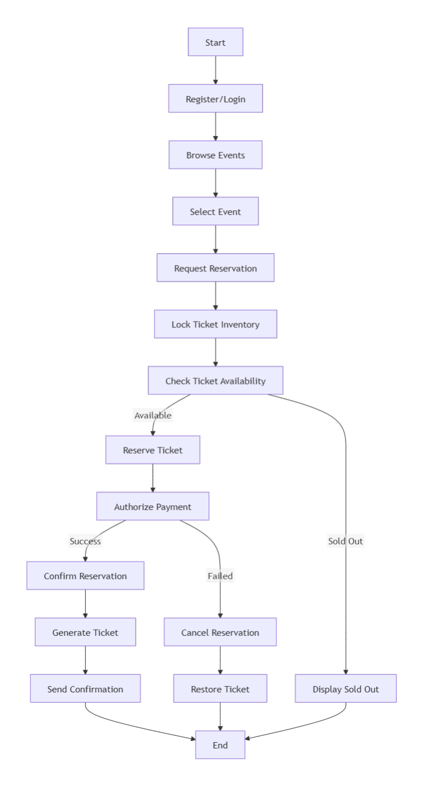
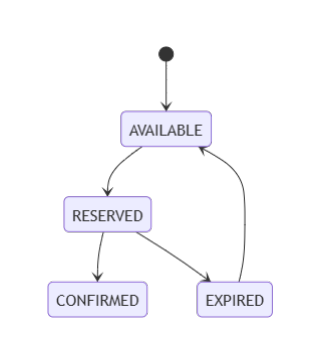

# Concurrency-Safe Online Ticketing System

## Overview

This project is a UML-based system design for a concurrency-safe online event ticketing platform.

The system prevents:
- double booking
- ticket collisions
- duplicate successful payments

when multiple users attempt to buy the same remaining ticket simultaneously.

---

## Main Features

- User registration and login
- Event browsing
- Ticket reservation
- Secure payment processing
- Reservation expiration handling
- E-ticket generation
- Admin event management

---

## Concurrency Protection

The system ensures that when only one ticket remains:
- only one reservation succeeds
- only one payment is captured
- unsuccessful users are not charged

The design uses:
- database transactions
- row-level locking
- reservation confirmation
- payment authorization before capture

---

## UML Diagrams

This repository will include:
- Use Case Diagram
- Class Diagram
- Sequence Diagram
- Activity Diagram
- Reservation State Diagram

---

## Planned Technologies

### Frontend
- HTML
- CSS
- JavaScript

### Backend
- Laravel
- Node.js

### Database
- MySQL
- PostgreSQL

### Payment Integration
- Stripe
- M-Pesa

---

## Future Improvements

- QR code ticket validation
- Mobile app support
- Redis distributed locking
- Real-time notifications
- Seat selection
- Cloud deployment

---

## Purpose

This project was created as a system analysis and UML design portfolio project for industrial attachment and future software implementation.

## Documentation

### System Documentation
- [Introduction](docs/introduction.md)
- [Requirements](docs/requirements.md)
- [Database Design](docs/database-design.md)
- [System Architecture](docs/system-architecture.md)
- [Future Improvements](docs/future-improvements.md)

---

## UML Diagrams

### Use Case Diagram

Explanation:
- [Use Case Diagram Documentation](diagrams/use-case-diagram.md)

---

### Class Diagram

Explanation:
- [Class Diagram Documentation](diagrams/class-diagram.md)

---

### Sequence Diagram

Explanation:
- [Sequence Diagram Documentation](diagrams/sequence-diagram.md)

---

### Activity Diagram

Explanation:
- [Activity Diagram Documentation](diagrams/activity-diagram.md)

---

### State Diagram

Explanation:
- [State Diagram Documentation](diagrams/state-diagram.md)